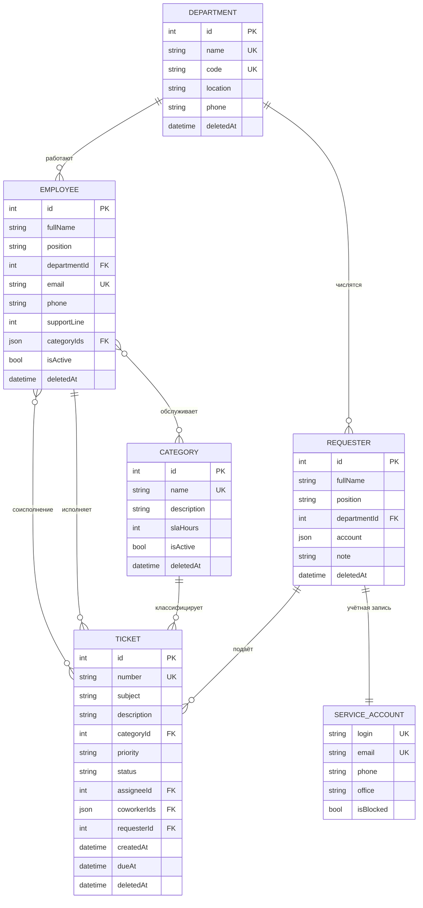

# Модель данных

Раздел отчёта по практической работе 3: логическая и физическая схемы,
словарь данных и перечень проверок по каждому полю.

С ПР4 данные приходят с сервера, и у моделей появилось второе,
серверное представление: на запись уходят идентификаторы связей,
на чтение приходят развёрнутые объекты и счётчики связанных записей.
Оно описано в [../api/КОНТРАКТ-API.md](../api/КОНТРАКТ-API.md), раздел 3.
Состав полей и правила проверки при этом не изменились — сервер
повторяет проверки, приведённые ниже, и добавляет к ним те, которые
клиент выполнить не может: уникальность и существование ссылок.

## 1. Логическая схема



Три типа связей и то, как они выглядят в интерфейсе:

| Тип | Пара | Элемент управления |
|---|---|---|
| Многие к одному | `Ticket` → `TicketCategory` | выпадающий список |
| Многие к одному | `Ticket` → `Employee` (исполнитель) | выпадающий список, сужаемый категорией |
| Многие к одному | `Ticket` → `Requester` | выпадающий список |
| Многие к одному | `Employee` → `Department` | выпадающий список |
| Многие к одному | `Requester` → `Department` | выпадающий список |
| Многие ко многим | `Ticket` ↔ `Employee` (соисполнители) | набор `FilterChip` |
| Многие ко многим | `Employee` ↔ `TicketCategory` (компетенции) | набор `FilterChip` |
| Один к одному | `Requester` ↔ `ServiceAccount` | вложенная группа полей |

Связь многие ко многим хранится списком идентификаторов в самой записи,
а не отдельной таблицей связей: клиентское хранилище — это набор
документов, соединять две коллекции по ключу здесь нечем. В ПР4, когда
данные придут с сервера, состав полей останется тем же — `authorIds`-подобные
списки контракт учебного API отдаёт именно так.

## 2. Физическая схема

Хранилище — `localStorage` браузера через `shared_preferences`. Каждая
коллекция лежит под своим ключом одной строкой JSON — массивом объектов.

| Ключ | Содержимое |
|---|---|
| `sd.schemaVersion` | целое: версия формата данных, сейчас `1` |
| `sd.v1.tickets` | массив заявок |
| `sd.v1.employees` | массив сотрудников поддержки |
| `sd.v1.requesters` | массив заявителей вместе с учётными записями |
| `sd.v1.departments` | массив отделов |
| `sd.v1.categories` | массив категорий |

Версия входит в имя ключа. Когда состав полей модели изменится, версия
поднимается: записи прошлой версии перестают читаться, стираются, и
пользователь получает сообщение — вместо падения при разборе.

Пример записи заявки:

```json
{
  "id": 2,
  "number": "SD-000002",
  "subject": "Не открывается 1С: Предприятие",
  "description": "При запуске появляется сообщение об ошибке…",
  "categoryId": 2,
  "priority": "critical",
  "status": "in_progress",
  "assigneeId": 5,
  "coworkerIds": [1, 2],
  "requesterId": 2,
  "createdAt": "2026-08-04T10:40:00.000",
  "dueAt": "2026-08-04T14:00:00.000",
  "deletedAt": null
}
```

Перечисления пишутся кодом (`"critical"`), а не порядковым номером:
вставка нового значения в середину `enum` не должна менять смысл уже
сохранённых записей.

Дата удаления `deletedAt` есть у всех пяти сущностей — это логическое
удаление: запись уходит из выборок, но остаётся в хранилище и может быть
восстановлена. Физическое удаление стирает её из массива.

## 3. Словарь данных

### 3.1. Ticket — заявка

| Поле | Тип | Обяз. | Описание |
|---|---|---|---|
| `id` | int | да | Первичный ключ, выдаётся хранилищем |
| `number` | String | да | Регистрационный номер `SD-000012`, уникален |
| `subject` | String | да | Тема обращения |
| `description` | String | да | Что произошло и когда |
| `categoryId` | int | да | Ссылка на категорию |
| `priority` | enum | да | `low`, `normal`, `high`, `critical` |
| `status` | enum | да | `new`, `in_progress`, `waiting`, `resolved`, `closed` |
| `assigneeId` | int? | нет | Исполнитель; `null` — заявка не распределена |
| `coworkerIds` | List\<int\> | нет | Соисполнители |
| `requesterId` | int | да | Ссылка на заявителя |
| `createdAt` | DateTime | да | Момент регистрации, ставится при создании |
| `dueAt` | DateTime | да | Плановый срок решения по SLA |
| `deletedAt` | DateTime? | нет | Отметка логического удаления |

### 3.2. Employee — сотрудник поддержки

| Поле | Тип | Обяз. | Описание |
|---|---|---|---|
| `id` | int | да | Первичный ключ |
| `fullName` | String | да | Фамилия, имя и отчество |
| `position` | String | да | Должность |
| `departmentId` | int | да | Ссылка на отдел |
| `email` | String | да | Служебный адрес почты, уникален |
| `phone` | String | да | Служебный телефон |
| `supportLine` | int | да | Линия поддержки: 1, 2 или 3 |
| `categoryIds` | List\<int\> | да | Обслуживаемые категории — компетенции |
| `isActive` | bool | да | Работает; уволенного нельзя назначить исполнителем |
| `deletedAt` | DateTime? | нет | Отметка логического удаления |

### 3.3. Requester — заявитель

| Поле | Тип | Обяз. | Описание |
|---|---|---|---|
| `id` | int | да | Первичный ключ |
| `fullName` | String | да | Фамилия, имя и отчество |
| `position` | String | да | Должность |
| `departmentId` | int | да | Ссылка на отдел |
| `account` | ServiceAccount | да | Учётная запись, связь один к одному |
| `note` | String | нет | Примечание службы поддержки |
| `deletedAt` | DateTime? | нет | Отметка логического удаления |

### 3.4. ServiceAccount — учётная запись

Вложенная сущность связи один к одному. Отдельного экрана и собственного
идентификатора не имеет: принадлежит ровно одному заявителю.

| Поле | Тип | Обяз. | Описание |
|---|---|---|---|
| `login` | String | да | Доменный логин `ivanov.ii`, уникален |
| `email` | String | да | Адрес почты, уникален |
| `phone` | String | да | Телефон |
| `office` | String | да | Рабочее место: корпус и кабинет |
| `isBlocked` | bool | да | Учётная запись заблокирована |

### 3.5. Department — отдел

| Поле | Тип | Обяз. | Описание |
|---|---|---|---|
| `id` | int | да | Первичный ключ |
| `name` | String | да | Название, уникально |
| `code` | String | да | Короткий код `ITSUP`, уникален |
| `location` | String | да | Корпус и кабинет |
| `phone` | String | да | Телефон отдела |
| `deletedAt` | DateTime? | нет | Отметка логического удаления |

### 3.6. TicketCategory — категория заявок

| Поле | Тип | Обяз. | Описание |
|---|---|---|---|
| `id` | int | да | Первичный ключ |
| `name` | String | да | Название, уникально |
| `description` | String | да | Что относится к категории |
| `slaHours` | int | да | Норматив решения в часах |
| `isActive` | bool | да | Действует; закрытая не предлагается в новых заявках |
| `deletedAt` | DateTime? | нет | Отметка логического удаления |

## 4. Проверки полей

Проверки описаны в `lib/core/validators.dart` и подключаются к полям
списком: возвращается первая сработавшая. Ошибка показывается под самим
полем.

### 4.1. Заявка

| Поле | Проверки |
|---|---|
| `number` | обязательно · формат `SD-000012` · **уникален** |
| `dueAt` | обязательно |
| `subject` | обязательно · от 5 до 120 символов |
| `description` | обязательно · от 10 до 1000 символов |
| `categoryId` | обязательно · только действующая категория из справочника |
| `requesterId` | обязательно · только действующий заявитель из справочника |
| `assigneeId` | необязательно · только сотрудник с компетенцией по выбранной категории |
| `priority` | обязательно · значение из перечисления |
| `status` | обязательно · значение из перечисления |
| `coworkerIds` | необязательно · только сотрудники с компетенцией, кроме исполнителя |

### 4.2. Сотрудник поддержки

| Поле | Проверки |
|---|---|
| `fullName` | обязательно · от 5 до 100 символов · формат ФИО с заглавных букв |
| `position` | обязательно · от 3 до 80 символов |
| `departmentId` | обязательно · только действующий отдел из справочника |
| `email` | обязательно · формат `имя@домен.ru` · не длиннее 60 · **уникален** |
| `phone` | обязательно · формат `+7 495 000-00-00` |
| `supportLine` | обязательно · целое · больше нуля · от 1 до 3 |
| `categoryIds` | обязательно · хотя бы одна категория |
| `isActive` | переключатель, проверок нет |

### 4.3. Заявитель и его учётная запись

| Поле | Проверки |
|---|---|
| `fullName` | обязательно · от 5 до 100 символов · формат ФИО |
| `position` | обязательно · от 3 до 80 символов |
| `departmentId` | обязательно · только действующий отдел |
| `account.login` | обязательно · латиница в нижнем регистре, цифры, точка и дефис, от 3 до 30 · **уникален** |
| `account.email` | обязательно · формат адреса · не длиннее 60 · **уникален** |
| `account.phone` | обязательно · формат телефона |
| `account.office` | обязательно · от 3 до 60 символов |
| `account.isBlocked` | переключатель, проверок нет |
| `note` | необязательно · не длиннее 300 символов |

### 4.4. Отдел

| Поле | Проверки |
|---|---|
| `name` | обязательно · от 3 до 80 символов · **уникально** |
| `code` | обязательно · заглавная латиница и цифры, от 2 до 10 · **уникален** |
| `phone` | обязательно · формат телефона |
| `location` | обязательно · от 3 до 60 символов |

### 4.5. Категория заявок

| Поле | Проверки |
|---|---|
| `name` | обязательно · от 3 до 60 символов · **уникально** |
| `description` | обязательно · от 10 до 200 символов |
| `slaHours` | обязательно · целое · больше нуля · от 1 до 720 |
| `isActive` | переключатель, проверок нет |

### 4.6. Проверки уровня хранилища

Уникальность и целостность ссылок проверяет не форма, а репозиторий:
форма может не знать про остальные записи, а в ПР4 та же проверка
повторится на сервере.

| Проверка | Где | Что происходит при нарушении |
|---|---|---|
| Уникальность | `checkUnique` каждого репозитория | `UniqueConstraintException` с именем поля; форма показывает сообщение под этим полем |
| Ссылочная целостность | `StoredRepository._checkReferences` | `ReferenceConstraintException`; удаление отклоняется, пользователь видит число связанных записей по каждому виду |

Кто на кого ссылается — объявлено в `AppRepositories`:

| Удаляемая запись | Проверяются ссылки |
|---|---|
| Отдел | сотрудники, заявители |
| Категория | заявки, сотрудники (компетенции) |
| Сотрудник | заявки (исполнение и соисполнение) |
| Заявитель | заявки |

Уже удалённые записи в счёт не идут: отдел, на который ссылается только
логически удалённый сотрудник, удалить можно.
